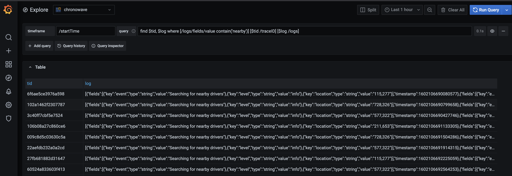

# OpenTracing with Jaeger/Grafana using ChronoWave as storage backend

This is *single node* mode embedded [ChronoWave](https://github.com/chronowave/chronowave) as Jaeger storage backend. It also supports ad hoc query through Grafana *Explore* UI.

## Start Jaeger all-in-one and Grafana

`git clone` this repo

```shell script
cd docker-componse
docker-componse up
```
Jaeger UI is at http://localhost:16686, Grafana UI is at http://localhost:3000

## ChronoWave features
1. supports keyword and wild card UTF-8 character search. For instance, if the input is `db.statement="User"` in *Tags* search field, the results will contain spans have at least one tag field where `key=db.statment` and `value` has word `User` (case sensitive) in it.
2. requires less system resources to store/process/query span.
3. supports ad hoc query through Grafana *Explore* with SSQL
4. the limit of nested tags/logs field is 65536 per span

## How it works

### high level architecture
```text
   ┌────┐      ┌────Container───┐                      
   │┌───┴┐     │┌──────────────┐│                      
───┴┤┌───┴┬────▶│    Jaeger    ││                      
    └┤span│    │└───────▲──────┘│                      
     └────┘    │  plugin│       │                      
               │  ┌─────▼────┐.─. ad hoc query ───────┐
               │  │ChronoWave(   )◀──────────▶│Grafana│
               │  └─────▲────┘`─'             └───────┘
               └───────┬┴───────┘                      
                    ┌──▼────┐                          
                    │ /index│                          
                    │ /wal  │                          
                    │ db    │                          
                    └─host──┘                          
```
### collecting spans
1. Jaeger collector forwards spans to storage backend through gRPC plugin. ChronoWave marshals span into [ElasticSearch document model](https://github.com/jaegertracing/jaeger/blob/master/plugin/storage/es/spanstore/dbmodel/model.go), saves JSON files in `wal` directory.
   * Note: ChronoWave is a schema agnostic data store.
2. construct self-compressed indices. Chronowave has two timer tasks
   * Near time. Build index with all files in `wal` directory.
   * On Demand. Build long term index in `index` directory and remove indexed files from `wal` directory.
3. create secondary auxiliary index:

   | JSON path   | Type |  SSQL syntax | Description |
   | ----------- | ---------- | ----------- | ----------- |
   | /startTime  | timestamp  | `[$ts /startTime timeframe(from, to)]` | timestamp in microsecond, used for time range query |
   | /traceID    | key        | `[$tid /traceID key('2020')]` | string value, used as key lookup |
   | /spanID     | key        | `[$sid /spanID key('2020')]` | string value, used as key lookup |
   
4. repeat 2 and 3

### Using Jaeger UI

1. query has time range. 
   * look up timestamp secondary index to find all index files in the range.
   * scatter queries to all available CPUs and gather the result
2. query by key, ie traceID or spanID. 
   * look up key secondary index to find all index files contains the value.
   * scatter queries to all available CPUs and gather the result
 
### Ad Hoc query using Grafana Explore

The timestamp field should be `/startTime`. *Note: timestamp in Jaeger span recorded as microsecond, in ad hoc query, please enter time value accordingly.*
The following screen shot is the result of query `find $tid, $log where [/logs/fields/value contain('nearby')] [$tid /traceID] [$log /logs]`. The query is to list spans' traceID and logs if one of the log field contains word "nearby".
Please refer to the reference section for supported path in SSQL query.




## Reference
 
[ElasticSearch document model](https://github.com/jaegertracing/jaeger/blob/master/plugin/storage/es/spanstore/dbmodel/model.go)

```go
// Span is ES database representation of the domain span.
type Span struct {
	TraceID       TraceID     `json:"traceID"`
	SpanID        SpanID      `json:"spanID"`
	ParentSpanID  SpanID      `json:"parentSpanID,omitempty"` // deprecated
	Flags         uint32      `json:"flags,omitempty"`
	OperationName string      `json:"operationName"`
	References    []Reference `json:"references"`
	StartTime     uint64      `json:"startTime"` // microseconds since Unix epoch
	// ElasticSearch does not support a UNIX Epoch timestamp in microseconds,
	// so Jaeger maps StartTime to a 'long' type. This extra StartTimeMillis field
	// works around this issue, enabling timerange queries.
	StartTimeMillis uint64     `json:"startTimeMillis"`
	Duration        uint64     `json:"duration"` // microseconds
	Tags            []KeyValue `json:"tags"`
	// Alternative representation of tags for better kibana support
	Tag     map[string]interface{} `json:"tag,omitempty"`
	Logs    []Log                  `json:"logs"`
	Process Process                `json:"process,omitempty"`
}

// Reference is a reference from one span to another
type Reference struct {
	RefType ReferenceType `json:"refType"`
	TraceID TraceID       `json:"traceID"`
	SpanID  SpanID        `json:"spanID"`
}

// Process is the process emitting a set of spans
type Process struct {
	ServiceName string     `json:"serviceName"`
	Tags        []KeyValue `json:"tags"`
	// Alternative representation of tags for better kibana support
	Tag map[string]interface{} `json:"tag,omitempty"`
}

// Log is a log emitted in a span
type Log struct {
	Timestamp uint64     `json:"timestamp"`
	Fields    []KeyValue `json:"fields"`
}

// KeyValue is a key-value pair with typed value.
type KeyValue struct {
	Key   string      `json:"key"`
	Type  ValueType   `json:"type,omitempty"`
	Value interface{} `json:"value"`
}

// Service is the JSON struct for service:operation documents in ElasticSearch
type Service struct {
	ServiceName   string `json:"serviceName"`
	OperationName string `json:"operationName"`
}
```